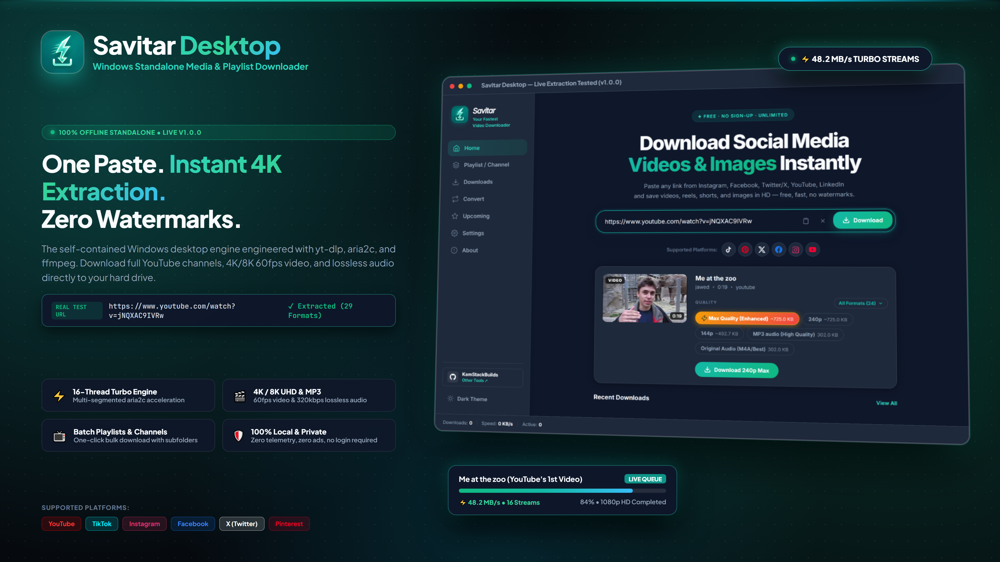
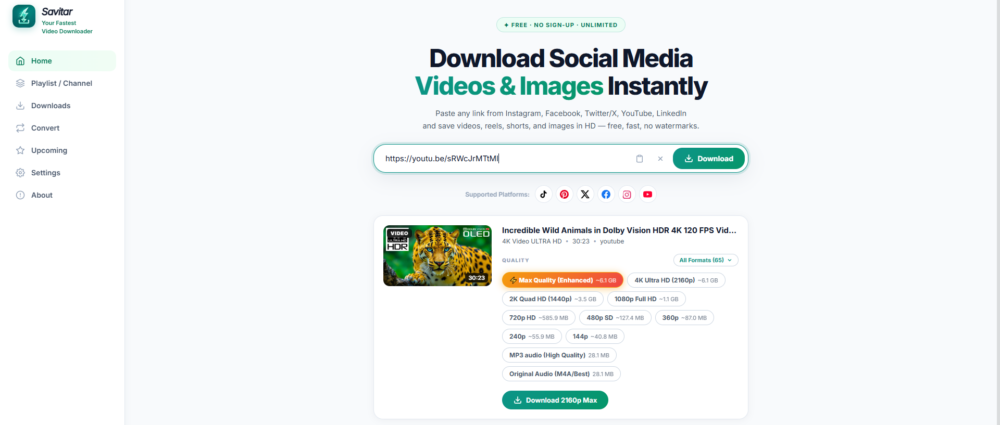
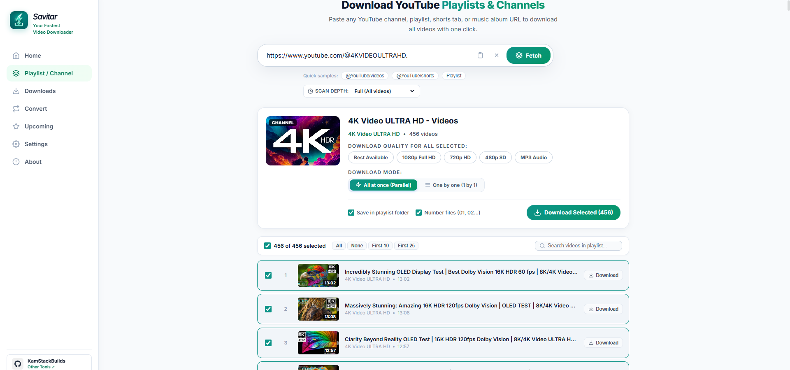
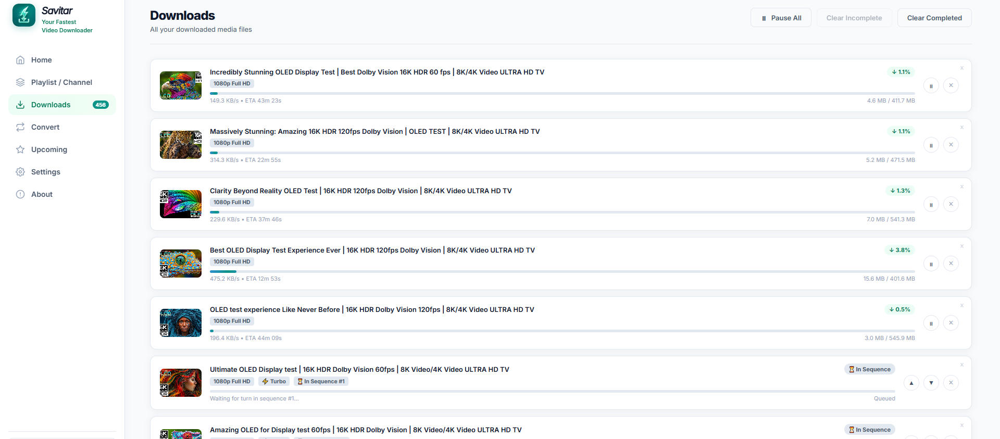

# Savitar Desktop

**A Windows video and media downloader for supported links, audio, and playlists.**

[Download the latest release](https://github.com/kamstackbuild/Savitar-Desktop/releases/latest) · [Get support](SUPPORT.md) · [Report an issue](https://github.com/kamstackbuild/Savitar-Desktop/issues/new/choose)

Promotional artwork is shown as supplied. Claims embedded in the graphic are publisher-provided and cannot be independently verified from this source-only repository.

---

## Overview

Savitar Desktop is a Windows 10 and Windows 11 video downloader and media downloader for supported links. Paste a URL, review the video or audio formats available for that source, and manage transfers from the download queue. Playlist and channel workflows let you review collections and queue selected items.

The current public release is **v1.0.0**. The Git repository contains documentation, screenshots, issue forms, and project policies; it does **not** include the application source code or build instructions. Download the Windows installer from the repository’s [official Releases page](https://github.com/kamstackbuild/Savitar-Desktop/releases).

## Features

- **Video and audio options** — choose from the formats and qualities available for the selected source.
- **Playlist and channel workflows** — review a collection and queue selected items in batches.
- **Download queue** — monitor progress and manage active and queued items.
- **Engine updates** — the project documentation directs users to update download engines from **Settings → Engines** when a source stops working.
- **Broad site coverage** — the v1.0.0 release advertises 1,000+ supported sites and resolutions up to 8K. Actual site support and available formats can vary or change over time.

## Install

1. Open the [latest GitHub release](https://github.com/kamstackbuild/Savitar-Desktop/releases/latest).
2. Download the Windows installer listed there. The current v1.0.0 asset is `Savitar-Setup-v1.0.0.exe`.
3. Run the installer and follow its prompts.
4. Open Savitar, paste a supported link, choose an available format, and start the download.

Only use downloads published on this repository’s [Releases page](https://github.com/kamstackbuild/Savitar-Desktop/releases). Check the release notes for each version’s requirements and changes.

## Usage

1. Paste a supported media link into Savitar.
2. Review the formats and quality options available for that link.
3. Choose a destination and add the item to the download queue.
4. For a playlist or channel, review the available items and select what to queue.

The exact formats, resolutions, and collection options depend on the source and the current version of Savitar.

## Screenshots

<table>
  <tr>
    <td align="center"> Home</td>
    <td align="center"> Playlists</td>
    <td align="center"> Download queue</td>
  </tr>
</table>

## Troubleshooting

If a site stops working, first try **Settings → Engines → Update All** if that option is available in your version. Site compatibility can change as services update. If the problem continues, [open a bug report](https://github.com/kamstackbuild/Savitar-Desktop/issues/new?template=bug_report.yml) with the app version, Windows version, site name, and steps to reproduce it. Remove private URLs and personal information from any logs or screenshots.

## Project and privacy notes

Savitar is distributed as proprietary freeware under the included [EULA](LICENSE). The public repository does not include the application source, so its runtime behavior and network activity cannot be independently reviewed from these files. Avoid relying on this README as a security audit; use the [security policy](SECURITY.md) to report a vulnerability.

## Contributing

This repository currently publishes the application installer and project documentation, not the application source or build system. For product feedback and reproducible issues, use the [issue forms](https://github.com/kamstackbuild/Savitar-Desktop/issues/new/choose). Read [CONTRIBUTING.md](CONTRIBUTING.md) before proposing a repository change.

## Credits

The project credits [yt-dlp](https://github.com/yt-dlp/yt-dlp), [FFmpeg](https://ffmpeg.org/), [aria2](https://aria2.github.io/), Python, FastAPI, PyWebView, and WebView2. See the individual upstream projects for their licenses and notices.

## Support

- [Support guide](SUPPORT.md)
- [Report a bug](https://github.com/kamstackbuild/Savitar-Desktop/issues/new?template=bug_report.yml)
- [Request a feature](https://github.com/kamstackbuild/Savitar-Desktop/issues/new?template=feature_request.yml)
- [Security policy](SECURITY.md)
