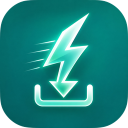
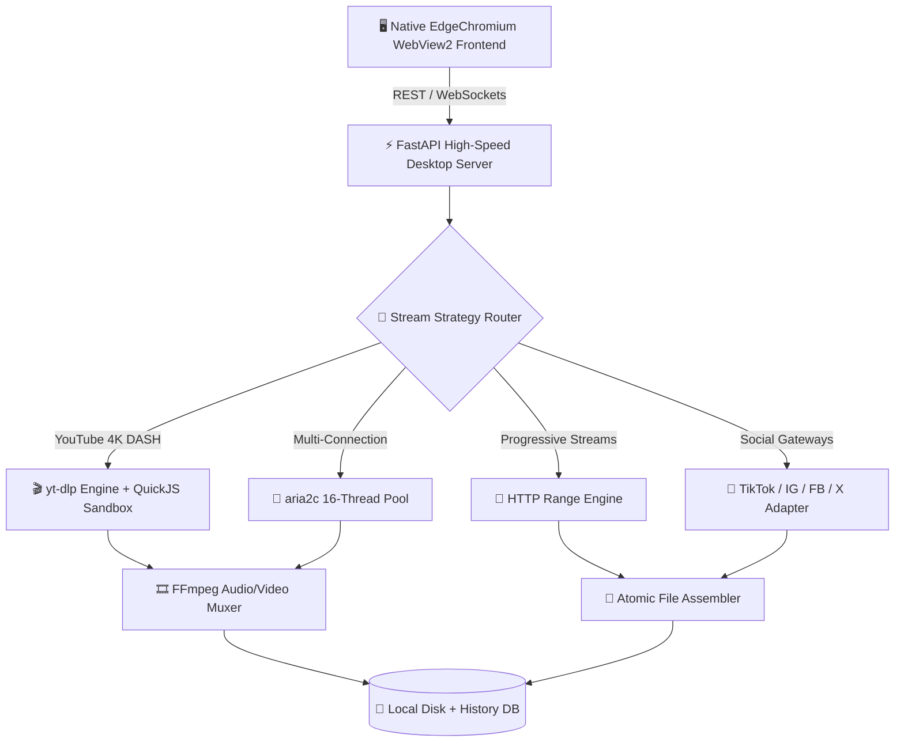

<div align="center">

# ⚡ Savitar Desktop

**The Fastest Multi-Threaded 4K Video Downloader for Windows**

A lightning-fast, open-source desktop media downloader built for power users, content creators, and archivists. Paste any video link, extract pristine 4K/8K 60fps streams, download entire channel catalogs, convert high-fidelity audio, and bypass throttling — with zero ads, zero telemetry, and no account required.

[](https://github.com/kamstackbuild/Savitar-Desktop/releases/latest)
[](https://github.com/kamstackbuild/Savitar-Desktop/releases/latest)
[](https://github.com/kamstackbuild/Savitar-Desktop/releases/latest)
[](LICENSE)

<br/><br/>

<a href="https://github.com/kamstackbuild/Savitar-Desktop/releases/latest">
  
</a>

<br/><br/>

[**⬇️ Download Savitar v1.0.0 for Windows (64-bit Installer)**](https://github.com/kamstackbuild/Savitar-Desktop/releases/latest/download/Savitar-Setup-v1.0.0.exe)

<sub>Windows 10/11 x64 · 100% Offline Standalone Installer · No internet needed during setup</sub>

<br/><br/>

<p align="center">
  
</p>

</div>

---

## 📸 Interface Showcase

| 1. Paste & Analyze | 2. 16-Thread Turbo Queue | 3. Channel & Playlist Batch |
| :---: | :---: | :---: |
|  |  |  |
| *Auto-inspects formats, bitrates & audio* | *Real-time speed graph, multi-part segments & cache recovery* | *Batch-selects 400+ videos with one-click parallel downloading* |

---

## ⚡ Why Savitar?

Most desktop downloaders feel stuck in 2015 — single-threaded, throttled, and breaking every time YouTube updates its player. Savitar is a ground-up rethink.

### 🚀 True 16-Thread Wire-Speed Acceleration

Standard downloaders use one HTTP stream. Savitar splits every file into **16 parallel segments** via a finely-tuned `aria2c` connection pool (`--split=16 --max-connection-per-server=16`), combined with concurrent DASH fragment streaming (`--concurrent-fragments=16`) through `yt-dlp`. On a 100 Mbps connection, typical downloads saturate your full bandwidth. On gigabit fiber, users report speeds above **80 MB/s**.

### 🎥 Lossless 4K, 8K & 60fps Preservation

Every stream is fetched at its **native bitrate** — no transcoding, no server-side re-encoding, no quality loss. Savitar requests the highest-quality DASH adaptive stream, downloads video and audio tracks separately, and merges them with an embedded **FFmpeg** binary using fast stream-copy (`-c copy`). The result: bit-identical output to what the platform serves.

### 🛡️ Dual-Route Anti-Block Protocol

> **When a site fights back, Savitar fights harder.**

YouTube constantly updates its `n`-parameter signature challenge to throttle third-party downloaders to ~50 KB/s. Most GUI tools break for days until upstream patches land. Savitar solves this **locally and instantly** using an embedded, sandboxed **QuickJS JavaScript runtime** (`bin/qjs.exe`) that executes YouTube's obfuscated challenge code in an isolated environment — no browser automation, no Puppeteer overhead, no external dependencies.

For social platforms, Savitar maintains dedicated **gateway adapters** that extract media directly from CDN servers:
- **TikTok**: Watermark-free original HD source extraction
- **Instagram**: Stories, Reels, IGTV, and carousel posts
- **Facebook**: Public videos at maximum available quality
- **X (Twitter)**: Native video stream extraction

### 📦 100% Offline Standalone Installer

Unlike tools that ship a 5 MB online stub and silently fail on restricted networks, Savitar's installer bundles everything:

| Bundled Component | Version | Purpose |
| :--- | :--- | :--- |
| Microsoft Edge WebView2 Evergreen Runtime | Latest | Native Windows UI rendering engine |
| Visual C++ Redistributable (x64) | 14.x | Core runtime dependency |
| yt-dlp | Latest | 1500+ site extraction engine |
| aria2c | 1.37.0 | Multi-threaded download accelerator |
| FFmpeg | 7.x | Audio/video muxing & conversion |
| QuickJS (qjs.exe) | 2024-01 | Sandboxed JS challenge solver |

Install on a fresh, air-gapped Windows machine with **zero internet required during setup**.

### 🔒 Zero Ads, Zero Tracking, Zero Paywalls

- No artificial download caps or daily quotas
- No watermarks applied to downloaded content
- No account registration or sign-up required
- No telemetry, analytics, or phone-home connections
- No bundled toolbars, browser extensions, or adware
- All settings stored atomically on your local drive

---

## 📋 Complete Feature Deep-Dive

### 🎬 Quality & Format Selection

Savitar presents every available stream as a selectable list: **8K, 4K UHD, 2K QHD, 1080p, 720p, 480p, 360p**, each showing exact bitrate and codec (VP9, AV1, H.264, H.265). Audio extraction supports **MP3 (up to 320 kbps), M4A (AAC-LC), FLAC, WAV, and OPUS** — with automatic metadata embedding and thumbnail art tagging.

### 📑 Playlist & Channel Batch Downloads

Paste a YouTube playlist or channel URL, and Savitar loads the entire catalog — **Videos, Shorts, Live streams, and Podcasts**. The batch panel lets you:
- **Select All** or cherry-pick individual items
- **Filter by title** using instant search
- **Sort** by upload date, duration, or view count
- Choose **Parallel Mode** (all at once) or **Sequential Mode** (one by one)
- Set a **uniform quality** (e.g., "All at 1080p") or let each pick its best

### 🗑️ Clear Incomplete Downloads

A dedicated **"Clear Incomplete"** button in the header instantly:
- Identifies aborted, failed, or paused downloads
- Deletes leftover `.part`, `.ytdl`, `.aria2`, and `.tmp` cache files from disk
- Recovers wasted storage space with one click
- Keeps your download folder pristine

### 📋 Clipboard Auto-Capture

Savitar quietly monitors your system clipboard. Copy a video URL anywhere — in your browser, in a chat app, in a document — and Savitar automatically detects the link and prepares it for download. No manual paste required.

### ⌨️ Global Keyboard Shortcut

Press <kbd>Ctrl</kbd>+<kbd>Shift</kbd>+<kbd>D</kbd> **from any application** in Windows to instantly capture whatever URL is on your clipboard and begin downloading — without switching windows, without clicking anything, without losing focus.

### 🎵 Media Converter & Remuxer

Already have media files on disk? Savitar's built-in converter can remux local files into:
- **Video**: MP4, MKV, WebM, AVI
- **Audio**: MP3, FLAC, WAV, M4A, OGG

When codecs match the target container, Savitar uses FFmpeg **stream-copy mode** — finishing conversions in seconds without CPU-intensive re-encoding.

### 🔔 System Tray & Background Mode

Closing the window doesn't kill your downloads. Savitar minimizes to the **system tray** and continues downloading in the background. Completed downloads trigger **Windows desktop toast notifications** so you know exactly when your files are ready.

### 💾 Atomic History & Settings Persistence

Savitar never corrupts your download history — even during sudden power loss or system crashes. It uses **atomic double-buffer writing** (`.tmp` → `os.replace`) for all persistent data, ensuring the previous good state survives any interruption.

### 🎨 Dual Fluent Themes

Switch between **Dark Mode** and **Light Mode** with a single click. Both themes use dynamic CSS design tokens for consistent styling, smooth transitions, and high-contrast accessibility that meets WCAG 2.1 guidelines.

### 🔄 Self-Updating Engine

Savitar checks for new releases via the GitHub Releases API and alerts you with a non-intrusive in-app notification when a newer version is available. One click to download the latest installer — your settings and history are preserved across updates.

---

## 🏛️ Architecture

Savitar is engineered with a decoupled, high-throughput desktop architecture:



### Technology Stack

| Layer | Technology | Role |
| :--- | :--- | :--- |
| **Frontend** | EdgeChromium WebView2 + Vanilla JS | Native Windows rendering, zero Electron bloat |
| **Backend** | Python 3.11 + FastAPI + Uvicorn | High-speed async REST API & WebSocket server |
| **Window Manager** | pywebview | Native OS window integration |
| **Download Engine** | yt-dlp + aria2c | 1500+ site support + 16-thread acceleration |
| **Media Processing** | FFmpeg 7.x | Muxing, remuxing, audio extraction |
| **JS Sandbox** | QuickJS (qjs.exe) | Challenge solver for anti-throttle bypass |
| **Persistence** | JSON + atomic writes | Crash-safe history and settings |

---

## 🌐 Supported Platforms

Savitar supports **1500+ websites** through its yt-dlp engine, with optimized native gateways for:

| Platform | Features |
| :--- | :--- |
| **YouTube** | 4K/8K DASH, playlists, channels, Shorts, Live, age-restricted, music |
| **TikTok** | Watermark-free HD, sound extraction, user profiles |
| **Instagram** | Reels, Stories, IGTV, carousel posts, profile downloads |
| **Facebook** | Public videos, Reels, Watch, live streams |
| **X (Twitter)** | Native video streams, GIF extraction |
| **Reddit** | Video + audio merge, gallery posts |
| **Twitch** | VODs, clips, live stream recording |
| **Vimeo** | Private/password-protected videos, 4K |
| **Dailymotion** | Full quality extraction |
| **SoundCloud** | Audio tracks, playlists, sets |
| **+ 1490 more** | [Full yt-dlp supported sites list](https://github.com/yt-dlp/yt-dlp/blob/master/supportedsites.md) |

---

## 📊 How Savitar Compares

| Feature | ⚡ Savitar | Standard yt-dlp GUIs | Online Web Downloaders |
| :--- | :---: | :---: | :---: |
| **Download Speed** | **16-Thread Turbo** (80+ MB/s on fiber) | Single stream (1–5 MB/s) | Capped (1–2 MB/s) |
| **Max Resolution** | **8K / 4K 60fps HDR** | 4K (often throttled) | 720p – 1080p |
| **Offline Install** | **✅ 100% Bundled** | ❌ Requires manual deps | N/A |
| **Anti-Throttle** | **✅ QuickJS Sandbox** | ❌ Throttled to 50 KB/s | ❌ Breaks on changes |
| **TikTok Watermark** | **✅ Clean Original HD** | ⚠️ Often watermarked | ❌ Popup-infested |
| **Playlist Batch** | **✅ 400+ Videos 1-Click** | ⚠️ Complex CLI | ❌ Paywalled |
| **Global Hotkey** | **✅** <kbd>Ctrl+Shift+D</kbd> | ❌ | ❌ |
| **Clipboard Monitor** | **✅ Auto-detect & queue** | ❌ Manual paste | ❌ |
| **Background Downloads** | **✅ System tray** | ❌ Blocks terminal | ❌ |
| **Self-Updating** | **✅ In-app alerts** | ❌ Manual | N/A |
| **Ads & Tracking** | **✅ Zero** | ✅ Clean | ❌ Loaded with ads |
| **Price** | **Free & Open Source** | Free | Free (limited) or paid |

---

## 💾 Download & Installation

### Official Windows Installer

| Asset | Platform | Arch | Size | SHA-256 |
| :--- | :--- | :--- | :--- | :--- |
| [**`Savitar-Setup-v1.0.0.exe`**](https://github.com/kamstackbuild/Savitar-Desktop/releases/latest/download/Savitar-Setup-v1.0.0.exe) | Windows 10/11 | x64 | 387.3 MB | `127cc2baa53d983c760aadc84099955d60b502ad6fcf2158b0d235c6f2faeae6` |

<details>
<summary><b>Full SHA-256 Checksum</b></summary>

```text
127cc2baa53d983c760aadc84099955d60b502ad6fcf2158b0d235c6f2faeae6
```

</details>

### Quick Start (3 Steps)

```
1️⃣  Download → Savitar-Setup-v1.0.0.exe from GitHub Releases
2️⃣  Install  → Double-click the installer (runs 100% offline)
3️⃣  Launch   → Open Savitar from Desktop or Start Menu, paste a link
```

### 🛡️ Verify Integrity

```powershell
Get-FileHash -Path "Savitar-Setup-v1.0.0.exe" -Algorithm SHA256
```

Compare the output with the checksum above. If they match, your file is authentic and untampered.

---

## ❓ Frequently Asked Questions

<details>
<summary><b>Is Savitar safe to use? Will it install adware?</b></summary>
<br/>
Savitar contains zero ads, zero telemetry, zero bundled toolbars, and zero browser extensions. The installer is clean, and every release includes a SHA-256 checksum for verification. The source code is open for inspection.
</details>

<details>
<summary><b>Why is the installer standalone?</b></summary>
<br/>
Savitar bundles everything for a true offline install: Microsoft Edge WebView2 Runtime, yt-dlp, aria2c, FFmpeg, QuickJS, Visual C++ runtime, and the application itself. This means it works on fresh Windows machines without downloading anything during setup.
</details>

<details>
<summary><b>Why is YouTube downloading at 50 KB/s on other tools?</b></summary>
<br/>
YouTube uses an <code>n</code>-parameter signature challenge that throttles unauthorized downloaders. Savitar bypasses this locally using its embedded QuickJS sandbox — solving the challenge without browser automation. This restores full-speed downloads.
</details>

<details>
<summary><b>Can I download private or age-restricted videos?</b></summary>
<br/>
Age-restricted videos are supported through yt-dlp's cookie-based authentication. Private videos require exporting browser cookies to a <code>cookies.txt</code> file.
</details>

<details>
<summary><b>Does Savitar work on Windows 7 or 8?</b></summary>
<br/>
No. Savitar requires Windows 10 version 1809+ or Windows 11 (64-bit). This is because it uses Microsoft Edge WebView2, which is only available on Windows 10+.
</details>

<details>
<summary><b>How do I update Savitar?</b></summary>
<br/>
Savitar checks for updates automatically via GitHub Releases. When a new version is available, you'll see an in-app notification. Click to download the latest installer — your settings and history are preserved.
</details>

---

## 💻 System Requirements

| Requirement | Minimum | Recommended |
| :--- | :--- | :--- |
| **OS** | Windows 10 (v1809+) | Windows 11 |
| **CPU** | Intel Core i3 / AMD Ryzen 3 | Intel Core i5+ / AMD Ryzen 5+ |
| **RAM** | 4 GB | 8 GB (for 4K muxing) |
| **Storage** | 600 MB (install) | 2+ GB (for downloads) |
| **Display** | 1280 × 720 | 1920 × 1080 |
| **Network** | Any broadband | 50+ Mbps (for turbo speeds) |

---

## 🤝 Contributing

We welcome bug reports, feature requests, and community feedback! See our [Contributing Guide](CONTRIBUTING.md) for details.

- [Report a Bug](https://github.com/kamstackbuild/Savitar-Desktop/issues/new?template=bug_report.md)
- [Request a Feature](https://github.com/kamstackbuild/Savitar-Desktop/issues/new?template=feature_request.md)
- [Security Policy](SECURITY.md)

---

## 📄 License

Savitar Desktop is released under the [MIT License](LICENSE). Free to use, modify, and distribute.

---

<div align="center">
  <br/>
  <sub>Engineered with precision by <b>KamStackBuild</b>. Built for speed, privacy, and fidelity.</sub>
  <br/>
  <sub>If Savitar saves you time, consider giving it a ⭐ on GitHub — it helps others discover the project.</sub>
</div>
